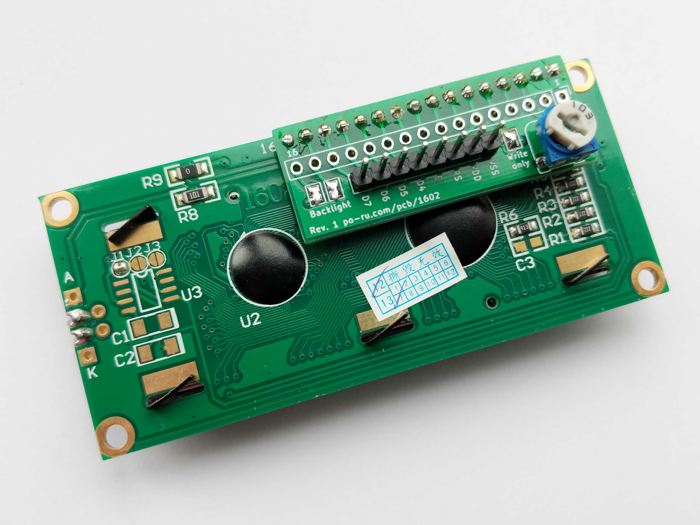

# 1602 Backpack

A small backpack board to add any or all of the following to a 1602 LCD display
(and other variants with similar pinouts, like 2004):

- contrast adjustment trimmer
- supply backlight from VDD/VSS
- set to write-only mode
- simplify the connection to 8 pins

There are three connector footprints. The topmost is for attaching to the back
of the display module. The middle footprint exposes the same 16 pins. The
lower footprint has eight pins: VSS, VDD (5V), RS, E, and four data lines D4-D7.

## Contrast adjustment

Install a 10K trimmer potentiometer. If you're using the long connector (in the
middle) don't solder a pin at pin 3 (VO)

## Backlight

Solder the two jumpers labelled "Backlight". Do not use pins 15 and 16 of the
long connector.

## Write-only

Does anyone ever read from these displays? If you're interfacing from a 3.3V
device, you won't want to. This jumper is essential when using the shorter
connector.

## How to ...

### Connect to an Arduino or Raspberry Pi with 8 wires

- Solder all three jumpers (Backlight and Write only)
- Solder a header to the short 8-pin connector
- Install a 10K trimmer

If using a 3.3V device, note that VDD still has to be 5V.

### Add contrast adjustment to a device without it (e.g. Kawai K1r)

- Install a 10K trimmer
- Remove pin 3 (VO) from a 1x16 header and solder it to the long
  connector footprint.
